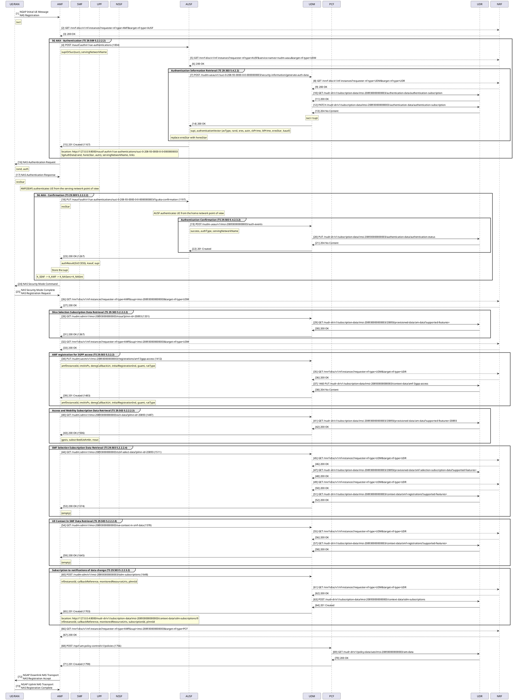

```plantuml
@startuml
scale 1.0
skinparam defaultFontName Helvetica Neue
skinparam MinClassWidth 80

autonumber "[#]"
Participant "UE/RAN" as UE

Participant AMF
Participant SMF
Participant UPF
Participant NSSF
Participant AUSF
Participant UDM
Participant PCF
Participant UDR
Participant NRF


UE->AMF: NGAP Initial UE Message\nNAS Registration
rnote right of UE: suci

AMF-->NRF: GET /nnrf-disc/v1/nf-instances?requester-nf-type=AMF&target-nf-type=AUSF
AMF<--NRF: 200 OK

group 5G AKA - Authentication (TS 29.509 5.2.2.2.2) 
AMF->AUSF: POST /nausf-auth/v1/ue-authentications (1004)
rnote right of AMF: supiOrSuci(suci), servingNetworkName

AUSF-->NRF: GET /nnrf-disc/v1/nf-instances?requester-nf-type=AUSF&service-names=nudm-ueau&target-nf-type=UDM
AUSF<--NRF: 200 OK
    group Authentication Information Retrieval (TS 29.503 5.4.2.2)
    AUSF->UDM: POST /nudm-ueau/v1/suci-0-208-93-0000-0-0-0000000003/security-information/generate-auth-data
    UDM-->NRF: GET /nnrf-disc/v1/nf-instances?requester-nf-type=UDM&target-nf-type=UDR
    UDM<--NRF: 200 OK
    UDM->UDR: GET /nudr-dr/v1/subscription-data/imsi-208930000000003/authentication-data/authentication-subscription
    UDM<-UDR: 200 OK
    UDM->UDR: PATCH /nudr-dr/v1/subscription-data/imsi-208930000000003/authentication-data/authentication-subscription
    UDM<-UDR: 204 No Content
    rnote over UDM: suci->supi
    AUSF<-UDM: 200 OK
    rnote right of AUSF: supi, authenticationVector (avType, rand, xres, autn, ckPrime, ikPrime, xresStar, kausf)
    rnote over AUSF: replace xresStar with hxresStar
    end
AMF<-AUSF: 201 Created (1167)
rnote right of AMF: location: http://127.0.0.9:8000/nausf-auth/v1/ue-authentications/suci-0-208-93-0000-0-0-0000000003\n5gAuthData(rand, hxresStar, autn), servingNetworkName, links
end


UE<-AMF: NAS Authentication Request
rnote right of UE: rand, auth
UE->AMF: NAS Authentication Response
rnote right of UE: resStar


rnote over AMF: AMF(SEAF) authenticates UE from the serving network point of view

group 5G AKA - Confirmation (TS 29.509 5.2.2.2.2) 
AMF->AUSF: PUT /nausf-auth/v1/ue-authentications/suci-0-208-93-0000-0-0-0000000003/5g-aka-confirmation (1197)
rnote right of AMF: resStar
rnote over AUSF: AUSF authenticates UE from the home network point of view
    group Authentication Confirmation (TS 29.503 5.4.2.3.2)
    AUSF->UDM: POST /nudm-ueau/v1/imsi-208930000000003/auth-events
    rnote right of AUSF: success, authType, servingNetworkName
    UDM->UDR: PUT /nudr-dr/v1/subscription-data/imsi-208930000000003/authentication-data/authentication-status
    UDM<-UDR: 204 No Content
    AUSF<-UDM: 201 Created
    end
AMF<-AUSF: 200 OK (1267)
rnote right of AMF: authResult(SUCCESS), kseaf, supi
rnote over AMF: Store the supi
rnote over AMF: K_SEAF -> K_AMF -> K_NASenc+K_NASint
end


UE<-AMF: NAS Security Mode Command
UE->AMF: NAS Security Mode Complete\nNAS Registration Request


AMF-->NRF: GET /nnrf-disc/v1/nf-instances?requester-nf-type=AMF&supi=imsi-208930000000003&target-nf-type=UDM
AMF<--NRF: 200 OK

group Slice Selection Subscription Data Retrieval (TS 29.503 5.2.2.2.2)
AMF->UDM: GET /nudm-sdm/v1/imsi-208930000000003/nssai?plmn-id=20893 (1331)
UDM->UDR: GET /nudr-dr/v1/subscription-data/imsi-208930000000003/20893/provisioned-data/am-data?supported-features=
UDM<-UDR: 200 OK
AMF<-UDM: 200 OK (1367)
end

AMF-->NRF: GET /nnrf-disc/v1/nf-instances?requester-nf-type=AMF&supi=imsi-208930000000003&target-nf-type=UDM
AMF<--NRF: 200 OK


group AMF registration for 3GPP access (TS 29.503 5.3.2.2)
AMF->UDM: PUT /nudm-uecm/v1/imsi-208930000000003/registrations/amf-3gpp-access (1412)
rnote right of AMF: amfInstanceId, imsVoPs, deregCallbackUri, initialRegistrationInd, guami, ratType
UDM-->NRF: GET /nnrf-disc/v1/nf-instances?requester-nf-type=UDM&target-nf-type=UDR
UDM<--NRF: 200 OK
UDM->UDR: 1460 PUT /nudr-dr/v1/subscription-data/imsi-208930000000003/context-data/amf-3gpp-access
UDM<-UDR: 204 No Content
AMF<-UDM: 201 Created (1483)
rnote right of AMF: amfInstanceId, imsVoPs, deregCallbackUri, initialRegistrationInd, guami, ratType
end


group Access and Mobility Subscription Data Retrieval (TS 29.503 5.2.2.2.3)
AMF->UDM: GET /nudm-sdm/v1/imsi-208930000000003/am-data?plmn-id=20893 (1487)
UDM->UDR: GET /nudr-dr/v1/subscription-data/imsi-208930000000003/20893/provisioned-data/am-data?supported-features=20893
UDM<-UDR: 200 OK
AMF<-UDM: 200 OK (1506)
rnote right of AMF: gpsis, subscribedUeAmbr, nssai
end

group SMF Selection Subscription Data Retrieval (TS 29.503 5.2.2.2.4)
AMF->UDM: GET /nudm-sdm/v1/imsi-208930000000003/smf-select-data?plmn-id=20893 (1511)
UDM-->NRF: GET /nnrf-disc/v1/nf-instances?requester-nf-type=UDM&target-nf-type=UDR
UDM<--NRF: 200 OK
UDM->UDR: GET /nudr-dr/v1/subscription-data/imsi-208930000000003/20893/provisioned-data/smf-selection-subscription-data?supported-features=
UDM<-UDR: 200 OK
UDM-->NRF: GET /nnrf-disc/v1/nf-instances?requester-nf-type=UDM&target-nf-type=UDR
UDM<--NRF: 200 OK
UDM->UDR: GET /nudr-dr/v1/subscription-data/imsi-208930000000003/context-data/smf-registrations?supported-features=
UDM<-UDR: 200 OK
AMF<-UDM: 200 OK (1574)
rnote right of AMF: (empty)
end

group UE Context In SMF Data Retrieval (TS 29.503 5.2.2.2.8)
AMF->UDM: GET /nudm-sdm/v1/imsi-208930000000003/ue-context-in-smf-data (1578)
UDM-->NRF: GET /nnrf-disc/v1/nf-instances?requester-nf-type=UDM&target-nf-type=UDR
UDM<--NRF: 200 OK
UDM->UDR: GET /nudr-dr/v1/subscription-data/imsi-208930000000003/context-data/smf-registrations?supported-features=
UDM<-UDR: 200 OK
AMF<-UDM: 200 OK (1645)
rnote right of AMF: (empty)
end

group Subscription to notifications of data change (TS 29.503 5.2.2.3.2)
AMF->UDM: POST /nudm-sdm/v1/imsi-208930000000003/sdm-subscriptions (1648)
rnote right of AMF: nfInstanceId, callbackReference, monitoredResourceUris, plmnId
UDM-->NRF: GET /nnrf-disc/v1/nf-instances?requester-nf-type=UDM&target-nf-type=UDR
UDM<--NRF: 200 OK
UDM->UDR: POST /nudr-dr/v1/subscription-data/imsi-208930000000003/context-data/sdm-subscriptions
UDM<-UDR: 201 Created
AMF<-UDM: 201 Created (1703)
rnote right of AMF: location: http://127.0.0.4:8000/nudr-dr/v1/subscription-data/imsi-208930000000003/context-data/sdm-subscriptions/9\nnfInstanceId, callbackReference, monitoredResourceUris, subscriptionId, plmnId
end


AMF-->NRF: GET /nnrf-disc/v1/nf-instances?requester-nf-type=AMF&supi=imsi-208930000000003&target-nf-type=PCF
AMF<--NRF: 200 OK

group AM Policy Association
AMF->PCF: POST /npcf-am-policy-control/v1/policies (1756)
PCF->UDR: GET /nudr-dr/v1/policy-data/ues/imsi-208930000000003/am-data
PCF<-UDR: 200 OK
AMF<-PCF: 201 Created (1798)
group

UE<-AMF: NGAP Downlink NAS Transport\nNAS Registration Accept
UE->AMF: NGAP Uplink NAS Trasnport\nNAS Registration Complete


@enduml
```